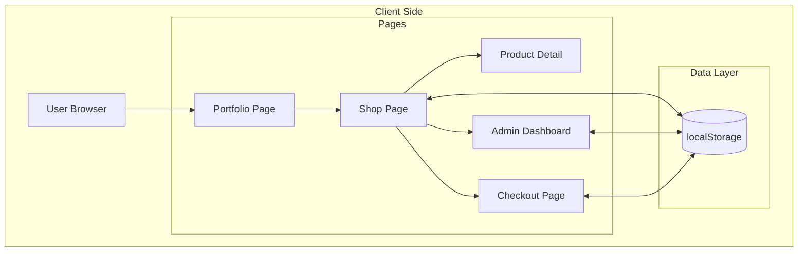
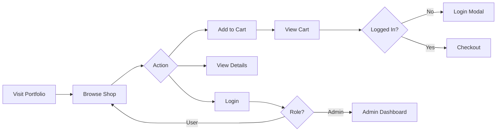

# Vincent Triluxe
### 🛒 Modern E-commerce Fashion Platform


---

## 📋 Project Overview

**Vincent Triluxe** is a comprehensive, fully-functional e-commerce fashion platform built entirely with vanilla HTML, CSS, and JavaScript. The platform showcases a complete online shopping experience with user authentication, shopping cart functionality, product management, and a feature-rich admin dashboard with analytics.

This project was developed as part of **BSIT3A IT8 Final Lab** at Lyceum of the Philippines University - Batangas, demonstrating proficiency in frontend web development, UI/UX design, and client-side data management.

### 🎯 Purpose & Goals

- **Showcase E-commerce Functionality**: Demonstrate a complete online shopping workflow from browsing to checkout
- **Role-Based Access Control**: Implement admin and user roles with different permissions and interfaces
- **Client-Side Data Persistence**: Utilize localStorage for cart, user accounts, and product management
- **Modern UI/UX Design**: Create an aesthetically pleasing, responsive shopping experience
- **Full-Stack Frontend**: Handle all business logic without backend dependencies

### 👥 Who It's For

- **Students**: Learning frontend web development and e-commerce concepts
- **Developers**: Exploring vanilla JavaScript implementations without frameworks
- **Educators**: Teaching modern web development techniques
- **Portfolio Viewers**: Demonstrating full-stack frontend development capabilities

---

## ✨ Features

### Core Functionality

- ✅ **User Authentication System**
  - Login and sign-up with email/password
  - Role-based access (Admin/User)
  - Session persistence via localStorage
  - Logout with session cleanup

- 🛒 **Shopping Cart Management**
  - Add/remove products from cart
  - Quantity adjustment per item
  - Real-time cart total calculation
  - Cart persistence across sessions
  - Visual cart indicator with item count

- 🔍 **Product Discovery**
  - Search products by name
  - Filter by category (Watch, Shirt, Jacket, Cap, Trouser)
  - Sort by price (ascending)
  - Sort alphabetically (A-Z)
  - Product image lightbox preview

- 📦 **Product Details Page**
  - Dynamic product information display
  - Product image gallery
  - Customer reviews section
  - Add to cart from detail page
  - Social sharing links

- 💳 **Checkout Flow**
  - Billing details form
  - Delivery address input
  - Order summary with cart items
  - Order placement functionality

### Admin Dashboard

- 📊 **Dashboard Analytics**
  - Total users, revenue, sales, and tickets stats
  - Animated counter displays
  - Revenue analytics chart (ApexCharts)
  - User activity visualization
  - Trend indicators (+/- percentages)

- 📈 **Advanced Analytics**
  - Sales trend charts
  - Conversion rate tracking
  - Monthly comparison metrics

- 👥 **User Management**
  - View all registered users
  - Add new users
  - Edit user details
  - Delete users
  - Role assignment (Admin/User)

- 🏪 **Product Management**
  - View all products with details
  - Add new products with image upload
  - Edit existing products
  - Delete products
  - Category assignment
  - Stock and sales tracking

- 🎨 **UI Customization**
  - Dark/Light theme toggle
  - Responsive sidebar navigation
  - Notification system

### Additional Features

- 📱 **Responsive Design** - Mobile-friendly layouts
- 🖼️ **Image Lightbox** - Click to enlarge product images
- ⭐ **Customer Reviews** - Product testimonials with star ratings
- 🔔 **Notifications** - User action feedback
- 💾 **Data Persistence** - All data saved to localStorage

---

## 🛠️ Tech Stack

### Frontend

| Technology | Purpose |
|------------|---------|
| **HTML5** | Semantic markup structure |
| **CSS3** | Styling, animations, responsiveness |
| **JavaScript (ES6+)** | Application logic, DOM manipulation |

### Libraries & Icons

| Library | Purpose |
|---------|---------|
| **Boxicons** | Shop page icons |
| **Font Awesome** | Dashboard & footer icons |
| **ApexCharts** | Dashboard analytics visualizations |
| **jQuery** | Portfolio animations |
| **Typed.js** | Typing animation effects |
| **Owl Carousel** | Project carousel slider |

### Data Storage

| Method | Usage |
|--------|-------|
| **localStorage** | Cart items, user accounts, login state |

---

## 🏗️ System Architecture

### High-Level Architecture



### User Flow



---

## 📸 Page Descriptions

### 1. Portfolio Page (`portfolio-html.html`)
Landing page showcasing the developer's profile with:
- Hero section with typing animation
- About section with downloadable CV
- Services offered
- Skills with progress bars
- Projects carousel
- Contact form

### 2. Shop Page (`shop1-html.html`)
Main e-commerce storefront featuring:
- Product grid with 15+ fashion items
- Search bar for product lookup
- Category filter dropdown
- Price and alphabetical sorting
- Shopping cart sidebar
- Login/logout functionality

### 3. Product Detail Page (`detail.html`)
Individual product view with:
- Large product image gallery
- Price information (old/new)
- Product description
- Quantity selector
- Add to cart button
- Customer reviews section
- Social sharing links

### 4. Checkout Page (`checkout-html.html`)
Order completion interface with:
- Billing details form
- Delivery address fields
- Order summary from cart
- Place order button

### 5. Admin Dashboard (`admin-html.html`)
Administrative control panel with:
- Statistics overview cards
- Revenue analytics charts
- User management table
- Product inventory manager
- Theme customization toggle

---

## 🚀 Installation Guide

### Prerequisites

- A modern web browser (Chrome, Firefox, Edge, Safari)
- A local web server (optional, for best experience)
- Text editor for customization (VS Code recommended)

### Step-by-Step Installation

#### 1. Clone or Download the Repository

```bash
# Using Git
git clone <repository-url>
cd Vincent-s-Portfolio-main/BSIT3A_IT8-Final-Lab_Delacruz

# OR download and extract the ZIP file
```

#### 2. Open the Project

**Option A: Direct File Opening**
- Navigate to the project folder
- Double-click `portfolio-html.html` to start

**Option B: Using Live Server (Recommended)**

If using VS Code:
1. Install the "Live Server" extension
2. Right-click on `portfolio-html.html`
3. Select "Open with Live Server"

**Option C: Using Python HTTP Server**

```bash
# Navigate to project folder
cd BSIT3A_IT8-Final-Lab_Delacruz

# Start simple HTTP server
python -m http.server 8000

# Open in browser: http://localhost:8000/portfolio-html.html
```

#### 3. Navigate the Application

- Start at the **Portfolio** page
- Click "View Project" under Vincent Triluxe to access the shop
- Browse products, add to cart, and explore features

---

## 📖 Usage Instructions

### Shopping as a User

1. **Browse Products**
   - Open the Shop page (`shop1-html.html`)
   - Use the search bar to find specific products
   - Filter by category using the dropdown
   - Sort by price or name using the buttons

2. **Add to Cart**
   - Click the shopping bag icon on any product
   - View cart by clicking the cart icon in the header
   - Adjust quantities or remove items as needed

3. **Create an Account**
   - Click "Login" in the header
   - Select "Sign Up" link
   - Fill in your details and select "User" role
   - Complete registration

4. **Checkout**
   - Ensure you're logged in
   - Click "Buy Now" in the cart
   - Fill in billing and delivery details
   - Place your order

### Admin Operations

1. **Access Admin Dashboard**
   - Click "Login" in the shop header
   - Enter admin credentials
   - Select "Admin" role
   - You'll be redirected to the dashboard

2. **View Analytics**
   - Dashboard shows total users, revenue, sales, tickets
   - Charts display revenue trends and user activity
   - Use the time filter for different date ranges

3. **Manage Products**
   - Navigate to "Products" in the sidebar
   - View all products in table/grid format
   - Click "Add Product" to create new items
   - Use Edit/Delete buttons for existing products

4. **Manage Users**
   - Navigate to "Users" in the sidebar
   - View all registered users
   - Add, edit, or delete user accounts

### Default Test Accounts

To test the system, register new accounts:

| Email | Password | Role |
|-------|----------|------|
| admin@test.com | admin123 | Admin |
| user@test.com | user123 | User |

> **Note**: Accounts are stored in localStorage. Clear browser data to reset.

---

## 📁 Project Structure

```
BSIT3A_IT8-Final-Lab_Delacruz/
│
├── 📄 Documentation
│   ├── BSIT3A_IT8-Final-Lab_DELACRUZ.pdf    # Project documentation
│   ├── Vincent_Triluxe_Documentation.docx    # Detailed writeup
│   └── Vincent_Dela_Cruz_CV.docx             # Developer CV
│
├── 🏠 Portfolio Page
│   ├── portfolio-html.html                   # Main landing page
│   ├── portfolio-css.css                     # Portfolio styling
│   └── portfolio-js.js                       # Portfolio interactions
│
├── 🛒 Shop Pages
│   ├── shop1-html.html                       # Main shop page
│   ├── shop-css.css                          # Shop styling
│   └── shop-js.js                            # Cart, auth, search logic
│
├── 📦 Product Detail
│   ├── detail.html                           # Product details page
│   ├── detail.css                            # Detail page styling
│   └── detail.js                             # Dynamic product loading
│
├── 💳 Checkout
│   ├── checkout-html.html                    # Checkout form
│   ├── checkout-css.css                      # Checkout styling
│   └── checkout-js.js                        # Order processing
│
├── 📊 Admin Dashboard
│   ├── admin-html.html                       # Admin interface
│   ├── admin-css.css                         # Dashboard styling
│   └── admin-js.js                           # Dashboard functionality
│
└── 🖼️ Assets
    └── img/
        ├── logo-black-removebg-preview.png   # Shop logo
        ├── logo2.png                         # Portfolio logo
        ├── profile.jpg                       # Developer photo
        ├── project.png                       # Project thumbnail
        │
        ├── shirt/                            # Shirt product images
        │   ├── Breeze Linen Shirt-₱1,595.00.png
        │   ├── Skyline Graphic Crop Tee-₱695.00.png
        │   └── Tropicana Resort Hawaiian Shirt-₱1,295.00.png
        │
        ├── watch/                            # Watch product images
        │   ├── AeroClassic Aviator 1945-₱7,750.00.png
        │   ├── AquaMaster Diver 300-₱12,950.00.png
        │   └── Skyline Aviator Chrono Watch-₱15,799.00.png
        │
        ├── jacket/                           # Jacket product images
        │   ├── Heritage Distressed Denim Jacket-₱3,250.00.png
        │   ├── Urban Aviator Bomber Jacket-₱3,999.00.png
        │   └── Victory Collegiate Varsity Jacket-₱4,499.00.png
        │
        ├── trouser/                          # Trouser product images
        │   ├── Breezy Linen Relaxed Pants-₱1,295.00.png
        │   ├── DurablePro Utility Work Pants-₱1,895.00.png
        │   └── Vintage Pleat Tapered Trousers-₱1,845.00.png
        │
        ├── cap/                              # Cap product images
        │   ├── Frontier Classic Cowboy Hat-₱1,895.00.png
        │   ├── Heritage Curve Baseball Cap-₱645.00.png
        │   └── Nordic Knit Beanie-₱495.00.png
        │
        └── [reviewer photos]                 # Customer review avatars
            ├── joshz.jpg
            ├── ralph.jpg
            ├── maru.jpg
            ├── timi.jpg
            └── jonas.jpg
```

---

## 🎨 Product Categories

| Category | Products | Price Range |
|----------|----------|-------------|
| 👔 **Shirt** | Breeze Linen Shirt, Skyline Graphic Crop Tee, Tropicana Resort Hawaiian Shirt | $11.88 - $27.28 |
| ⌚ **Watch** | AeroClassic Aviator, AquaMaster Diver, Skyline Aviator Chrono | $132.56 - $270.23 |
| 🧥 **Jacket** | Heritage Distressed Denim, Urban Aviator Bomber, Victory Collegiate Varsity | $55.59 - $76.95 |
| 👖 **Trouser** | Breezy Linen Relaxed Pants, DurablePro Utility Work Pants, Vintage Pleat Tapered | $22.15 - $32.41 |
| 🧢 **Cap** | Frontier Classic Cowboy Hat, Heritage Curve Baseball Cap, Nordic Knit Beanie | $8.46 - $32.41 |

---

## ⚙️ Key JavaScript Functions

### Cart Management (`shop-js.js`)

| Function | Purpose |
|----------|---------|
| `updateCart()` | Rebuilds cart UI and saves to localStorage |
| `updateCartIndicator()` | Updates cart count badge |
| `loadCartFromLocalStorage()` | Restores cart on page load |

### Search & Sort (`shop-js.js`)

| Function | Purpose |
|----------|---------|
| `initializeSearchFunctionality()` | Enables product search |
| `sortProducts()` | Sorts by price or name |
| Category filter event | Filters products by category |

### Authentication (`shop-js.js`)

| Function | Purpose |
|----------|---------|
| Login form handler | Validates and authenticates users |
| Signup form handler | Registers new users |
| `updateAuthButton()` | Toggles Login/Logout display |

### Admin Dashboard (`admin-js.js`)

| Function | Purpose |
|----------|---------|
| Counter animation | Animates statistics numbers |
| Chart initialization | Renders ApexCharts visualizations |
| User CRUD operations | Add/Edit/Delete users |
| Product CRUD operations | Add/Edit/Delete products |

---

## 🔧 Customization

### Adding New Products

1. Add product image to appropriate category folder in `img/`
2. Open `shop1-html.html`
3. Add new product box:

```html
<div class="product-box" data-category="shirt" data-id="unique-id">
    
    <i class='bx bx-show product-detail-icon'></i>
    <h2 class="product-title">Product Name</h2>
    <span class="price">$XX.XX</span>
    <i class='bx bx-shopping-bag add-card'></i>
</div>
```

### Modifying Theme Colors

Edit CSS variables in respective CSS files:
- Shop: `shop-css.css`
- Admin: `admin-css.css`
- Portfolio: `portfolio-css.css`

---

## 🐛 Known Limitations

- **No Backend**: Data is stored in localStorage (lost if browser data is cleared)
- **No Payment Processing**: Checkout is simulated, no actual transactions
- **Single Browser**: Cart and accounts are browser-specific
- **Static Products**: Admin product changes don't reflect in shop (requires manual HTML update)

---

## 🚧 Future Improvements

- [ ] Backend integration (Node.js/PHP with database)
- [ ] Real payment gateway (Stripe/PayPal)
- [ ] Order history and tracking
- [ ] Wishlist functionality
- [ ] Product reviews from logged-in users
- [ ] Email notifications
- [ ] Multi-image product uploads
- [ ] Inventory management sync
- [ ] Mobile app version

---

## 👨‍💻 Developer Information

| Field | Details |
|-------|---------|
| **Name** | Vincent Dela Cruz |
| **Course** | BSIT 3A |
| **Subject** | IT8 - Final Laboratory |
| **School** | Lyceum of the Philippines University - Batangas |
| **Email** | delacruz vincent085@gmail.com |
| **Location** | San Juan, Batangas, Philippines |

### Social Links

- 📘 [Facebook](https://www.facebook.com/thevinnnzzz)
- 📸 [Instagram](https://www.instagram.com/the_vinnnzzz/)

---

## 📄 License

This project was created for **academic purposes** as part of coursework at Lyceum of the Philippines University - Batangas. All rights reserved by the developer.

---

**End of Documentation**
