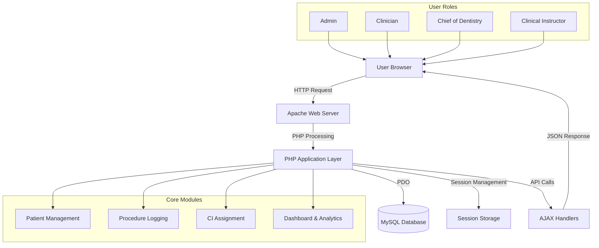
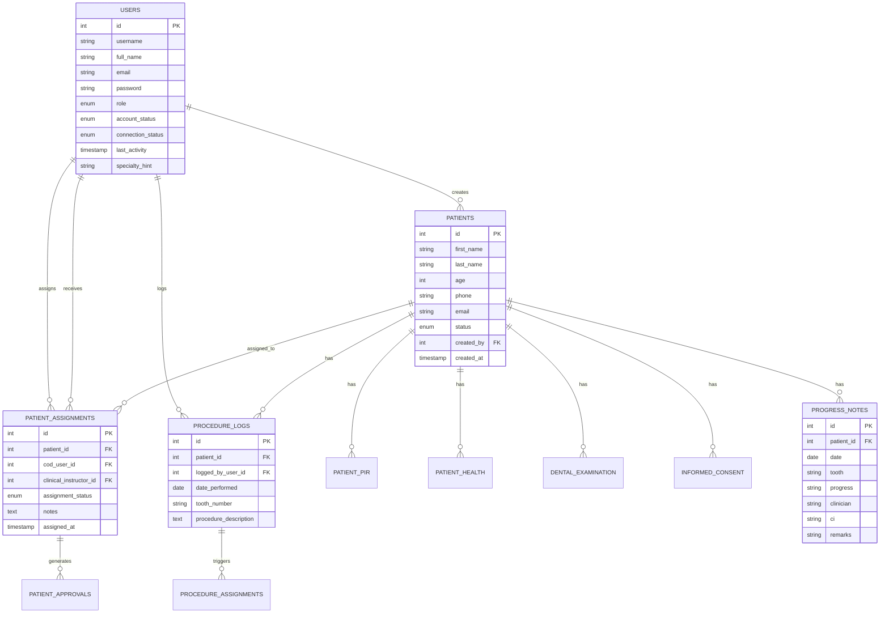

# iDENTify
### 🦷 Professional Dental Patient Management System


---

## 📋 Project Overview

**iDENTify** is a comprehensive, web-based dental patient management system designed to streamline clinical operations for dental clinics, academic institutions, and dental schools. The system provides a complete solution for managing patient information, clinical procedures, treatment records, and multi-level clinical supervision workflows.

### 🎯 Purpose & Goals

- **Digitize Patient Records**: Eliminate paper-based patient information records (PIR) and health questionnaires
- **Streamline Clinical Workflows**: Automate patient assignment between clinicians and clinical instructors
- **Enable Multi-Role Access**: Support different user roles with appropriate permissions and views
- **Track Procedures**: Maintain comprehensive logs of dental procedures and progress notes
- **Facilitate Clinical Education**: Support COD (Chief of Dentistry) oversight and clinical instructor approval workflows
- **Ensure Data Integrity**: Centralized database with proper foreign key relationships and data validation

### 👥 Who It's For

- **Dental Clinics**: Private practices seeking to modernize patient record management
- **Dental Schools**: Academic institutions requiring clinical supervision and student tracking
- **Teaching Hospitals**: Healthcare facilities with dental departments needing multi-tier approval workflows
- **Medical Records Administrators**: Staff responsible for maintaining patient data compliance and security

---

## ✨ Features

### Core Functionality

- ✅ **Multi-Role User Authentication**
  - Admin, Clinician, Clinical Instructor (CI), and Chief of Dentistry (COD) roles
  - Role-based access control (RBAC) system
  - Secure session management with activity tracking
  - User online/offline status indicators

- 📝 **Comprehensive Patient Information Records (PIR)**
  - Multi-step patient registration form (5 steps)
  - Step 1: Basic patient demographics and medical history
  - Step 2: Health questionnaire and clinical examination
  - Step 3: Dental examination with interactive tooth chart
  - Step 4: Informed consent and data privacy agreements
  - Step 5: Treatment progress notes and tracking

- 🦷 **Procedure Logging & Management**
  - Log dental procedures with date, tooth number, and details
  - Auto-assignment to available Clinical Instructors
  - Procedure acceptance and approval workflow
  - Comprehensive procedure logs with filtering and search

- 👨‍⚕️ **Clinical Instructor (CI) Assignment Workflow**
  - COD assigns patients to Clinical Instructors based on specialty
  - CI accepts/rejects patient assignments
  - Patient transfer requests between CIs
  - Real-time assignment notifications

- 📊 **Dashboard & Analytics**
  - Role-specific statistics and KPIs
  - Patient status distribution charts (Chart.js integration)
  - Monthly submission trends
  - Quick access to pending tasks and alerts

- 🔍 **Advanced Search & Filtering**
  - Search patients by name, email, phone
  - Filter by date range, status, assignment status
  - Export procedures log to Excel/PDF
  - AJAX-powered pagination for smooth navigation

- 🎨 **Modern UI/UX**
  - Dark mode support with persistent settings
  - Responsive design (mobile, tablet, desktop)
  - Gradient themes with purple/violet color scheme
  - Smooth animations and transitions

- 🔒 **Security Features**
  - Password hashing (bcrypt)
  - SQL injection protection (PDO prepared statements)
  - XSS protection (input sanitization)
  - Session timeout and auto-logout

---

## 🛠️ Tech Stack

### Backend
- **PHP 7.4+** - Server-side scripting language
- **MySQL 8.0+** - Relational database management system
- **PDO** - PHP Data Objects for database abstraction

### Frontend
- **HTML5** - Semantic markup
- **CSS3** - Styling with custom gradients
- **JavaScript (ES6+)** - Client-side interactivity
- **Tailwind CSS 3.4+** - Utility-first CSS framework
- **Chart.js** - Data visualization library
- **Remix Icon** - Icon library for UI elements

### Development Tools
- **XAMPP** - Local development environment (Apache + MySQL + PHP)
- **Git** - Version control
- **PowerShell** - Automation scripts for database setup

### Additional Libraries
- **PHPMailer** (if integrated) - Email notifications
- **FPDF/TCPDF** (potential) - PDF report generation

---

## 🏗️ System Architecture

### High-Level Architecture



### Database Schema Overview

The system uses a relational database with the following key tables:

- **users**: System users with role-based access
- **patients**: Core patient demographic information
- **patient_pir**: Patient Information Records (medical/dental history)
- **patient_health**: Health questionnaire data
- **dental_examination**: Dental exam findings and tooth charts
- **informed_consent**: Patient consent forms
- **progress_notes**: Treatment progress tracking
- **patient_assignments**: COD-to-CI patient assignments
- **patient_approvals**: CI approval records
- **procedure_logs**: Dental procedure logging
- **procedure_assignments**: Procedure workflow management

---

## 📸 Screenshots / UI Previews

> **Note**: Replace these placeholders with actual screenshot paths once captured.

### Login Page


### Admin Dashboard


### Patient List View


### Patient Information Record (PIR) Form


### Dental Examination Tool


### Procedure Logging


### Clinical Instructor Assignments


---

## 🚀 Installation Guide

### Prerequisites

Before installing iDENTify, ensure you have the following:

- **XAMPP** (or WAMP/MAMP) with:
  - PHP 7.4 or higher
  - MySQL 8.0 or higher
  - Apache 2.4 or higher
- **Git** (optional, for cloning the repository)
- **Web Browser** (Chrome, Firefox, Edge recommended)

### Step-by-Step Installation

#### 1. Clone or Download the Repository

```bash
# Using Git
cd C:\xampp\htdocs\
git clone <repository-url> iDENTify

# OR download and extract the ZIP file to C:\xampp\htdocs\iDENTify
```

#### 2. Start XAMPP Services

- Open XAMPP Control Panel
- Start **Apache** and **MySQL** services
- Verify they are running (green indicators)

#### 3. Create the Database

**Option A: Automated Setup (Recommended)**

1. Navigate to the `migrations` folder
2. Double-click `setup_database.bat`
3. Wait for the script to complete (you'll see "Setup complete!" message)

**Option B: Manual Setup via phpMyAdmin**

1. Open your browser and go to `http://localhost/phpmyadmin`
2. Click **New** to create a database
3. Database name: `identify_db`
4. Select **utf8mb4_unicode_ci** collation
5. Click **Create**
6. Select the `identify_db` database
7. Go to the **Import** tab
8. Import `migrations/database_setup.sql` (click **Go**)
9. Import `migrations/alter_database_setup_complete.sql` (click **Go**)

**Option C: Command Line Setup**

```powershell
# Open PowerShell in the project directory
cd C:\xampp\htdocs\iDENTify

# Create database
C:\xampp\mysql\bin\mysql.exe -u root -e "CREATE DATABASE IF NOT EXISTS identify_db;"

# Import base schema
C:\xampp\mysql\bin\mysql.exe -u root identify_db < migrations/database_setup.sql

# Import enhancements (triggers, procedures, etc.)
C:\xampp\mysql\bin\mysql.exe -u root identify_db < migrations/alter_database_setup_complete.sql
```

#### 4. Verify Database Setup

```powershell
# Check if tables were created
C:\xampp\mysql\bin\mysql.exe -u root identify_db -e "SHOW TABLES;"
```

You should see 12+ tables including: `users`, `patients`, `patient_pir`, `procedure_logs`, etc.

#### 5. Configure Database Connection

The default configuration should work out of the box. If needed, edit `config.php`:

```php
$host = 'localhost';
$dbname = 'identify_db';
$username = 'root';
$password = '';  // Change if you set a MySQL root password
```

#### 6. Access the System

1. Open your web browser
2. Navigate to: `http://localhost/iDENTify/`
3. You should see the login page

---

## 📖 Usage Instructions

### Default User Accounts

The system comes with pre-configured demo accounts:

| Username | Password | Role | Description |
|----------|----------|------|-------------|
| `admin` | `admin123` | Admin | Full system access |
| `dr.smith` | `password123` | Clinician | Can create patients and log procedures |
| `prof.johnson` | `password123` | Clinical Instructor | Reviews and approves patient assignments |
| `dr.davis` | `password123` | Clinician | Secondary clinician account |
| `prof.miller` | `password123` | Clinical Instructor | Secondary CI account |

⚠️ **Security Warning**: Change these default passwords immediately in production!

### User Workflows by Role

#### 1. Admin Workflow

**Purpose**: System administration and oversight

1. **Login** as Admin (`admin` / `admin123`)
2. **Dashboard** - View system-wide statistics
3. **Manage Users**: 
   - Navigate to `Users` tab
   - Add/edit/deactivate user accounts
   - Assign roles and update credentials
4. **Patient Oversight**:
   - View all patient records across all clinicians
   - Edit patient information
   - Delete records (with confirmation)
5. **Procedure Logging**:
   - Log procedures on behalf of clinicians
   - View comprehensive procedure logs with filters
6. **Settings**:
   - Update system configuration
   - Manage application settings

#### 2. Clinician Workflow

**Purpose**: Create and manage patient records

1. **Login** as Clinician (e.g., `dr.smith` / `password123`)
2. **Add New Patient**:
   - Click "Add New Patient" button
   - Fill out **Step 1** (Patient Demographics):
     - First Name, Last Name, Age, Contact Info
     - Medical History, Chief Complaint
   - Fill out **Step 2** (Health Questionnaire):
     - Medical conditions, allergies, medications
     - Clinical examination findings
   - Fill out **Step 3** (Dental Examination):
     - Use interactive tooth chart to mark findings
     - Assessment and treatment plan
   - Fill out **Step 4** (Informed Consent):
     - Digital signatures and consent forms
   - **Step 5** (Progress Notes):
     - Initial treatment notes (auto-generated)
3. **View Patients**:
   - See only patients they created
   - Filter by status, date range, or search by name
4. **Log Procedures**:
   - Navigate to "Procedures Log" menu
   - Select patient and log procedure details
   - System auto-assigns to available Clinical Instructor

#### 3. Chief of Dentistry (COD) Workflow

**Purpose**: Assign patients to Clinical Instructors

1. **Login** as COD
2. **View COD Patients Tab**:
   - See all patients created by Clinicians
   - View current assignment status
3. **Assign Patient to CI**:
   - Select unassigned patient
   - Choose appropriate Clinical Instructor based on specialty
   - Add assignment notes
   - Submit assignment
4. **Monitor Assignments**:
   - Track which CIs have accepted/pending assignments
   - View assignment history

#### 4. Clinical Instructor (CI) Workflow

**Purpose**: Review patient assignments and approve work

1. **Login** as Clinical Instructor (e.g., `prof.johnson` / `password123`)
2. **Set Specialty**:
   - Go to **Profile** page
   - Set "Procedure Details" field (e.g., "Orthodontics", "Oral Surgery")
   - This helps COD assign appropriate patients
3. **View CI Assignments**:
   - Navigate to "CI Patient Assignments" or "CI Procedure Assignments"
   - See pending patient assignments from COD
4. **Accept/Reject Assignment**:
   - Review patient details
   - Click "Accept" to take on the patient
   - Click "Reject" with reason if not appropriate
5. **Access Assigned Patients**:
   - Go to "Patients" tab
   - View only patients assigned and accepted by you
   - Edit progress notes and add remarks
6. **Approve Procedures**:
   - Navigate to "CI Approvals" tab
   - Review logged procedures requiring approval
   - Approve or request revisions
7. **Patient Transfers**:
   - Request to transfer patient to another CI if needed
   - Navigate to "Patient Transfers" menu
   - Select patient and target CI
   - Other CI must accept the transfer

### Common Tasks

#### Adding a Patient (Clinician/Admin)

1. Click **"Add New Patient"** button
2. Complete all 5 steps sequentially
3. Each step auto-saves before proceeding to next
4. Review and submit final patient record
5. Patient appears in your patient list with "Pending" status

#### Logging a Procedure

1. Navigate to **"Procedures Log"** menu
2. Click **"Log New Procedure"**
3. Select patient from dropdown
4. Fill in procedure details:
   - Date performed
   - Tooth number(s)
   - Procedure description
   - Remarks
5. Submit - procedure is auto-assigned to an online CI

#### Searching Patients

1. Use search bar at top of Patients table
2. Enter patient name, email, or phone number
3. Apply additional filters:
   - Date range (From/To)
   - Status (Approved/Pending/Declined)
4. Click **Search** to apply filters
5. Click **Clear Filters** to reset

---

## ⚙️ Configuration Details

### Environment Variables

The system primarily uses `config.php` for configuration. Key settings:

```php
// Database Configuration
$host = 'localhost';        // MySQL server address
$dbname = 'identify_db';    // Database name
$username = 'root';         // MySQL username
$password = '';             // MySQL password (empty for default XAMPP)

// Session Configuration
session_start();            // Initializes PHP sessions

// Activity Timeout (in minutes)
$timeoutMinutes = 5;        // User is marked offline after 5 minutes of inactivity
```

### Important File Locations

| Purpose | File Path | Description |
|---------|-----------|-------------|
| **Main Config** | `config.php` | Database connection and global functions |
| **Login Page** | `login.php` | User authentication entry point |
| **Dashboard** | `dashboard.php` | Main dashboard after login |
| **Patient Management** | `patients.php` | Patient list and search |
| **PIR Form Steps** | `edit_patient.php` <br> `edit_patient_step2.php` <br> `edit_patient_step3.php` <br> `edit_patient_step4.php` <br> `edit_patient_step5.php` | Multi-step patient information form |
| **Procedure Logging** | `clinician_log_procedure.php` | Clinician procedure logging interface |
| **Admin Procedures** | `admin_procedures_log.php` | Admin view of all procedures |
| **CI Assignments** | `ci_patient_assignments.php` <br> `ci_procedure_assignments.php` | CI assignment management |
| **Patient Transfers** | `ci_patient_transfers.php` | CI-to-CI patient transfer workflow |
| **COD Patients** | `cod_patients.php` | COD patient assignment interface |
| **Database Migrations** | `migrations/database_setup.sql` <br> `migrations/alter_database_setup_complete.sql` | Database schema files |

### Custom Styles

- **Primary Theme**: `css/` folder contains custom stylesheets
- **Dark Mode Override**: `dark-mode-override.css` - Dark theme customizations
- **Main Styles**: Inline Tailwind CSS with custom gradient colors

### API Endpoints

AJAX endpoints for dynamic content:

| Endpoint | Purpose | Method |
|----------|---------|--------|
| `ajax_dashboard.php` | Load dashboard data | GET |
| `ajax_patients.php` | Fetch patient list | GET |
| `ajax_cod_patients.php` | Fetch COD patient list | GET |
| `ajax_ci_assignments.php` | Get CI assignments | GET |
| `ajax_ci_procedure_assignments.php` | Get CI procedure assignments | GET |
| `ajax_ci_patient_transfer.php` | Handle patient transfers | POST |
| `api_online_ci.php` | Check online Clinical Instructors | GET |
| `api_heartbeat.php` | Keep user session alive | POST |

---

## 📁 Project Structure

```
iDENTify/
├── 📄 config.php                          # Database connection & global functions
├── 📄 login.php                           # Login page
├── 📄 index.php                           # Entry point/redirector
├── 📄 dashboard.php                       # Main dashboard
├── 📄 logout.php                          # Logout handler
│
├── 👥 User Management
│   ├── users.php                          # User list & management (Admin)
│   ├── profile.php                        # User profile page
│   └── settings.php                       # System settings
│
├── 🏥 Patient Management
│   ├── patients.php                       # Patient list view
│   ├── view_patient.php                   # Patient details view
│   ├── edit_patient.php                   # PIR Step 1 (Demographics)
│   ├── edit_patient_step2.php             # PIR Step 2 (Health Questionnaire)
│   ├── edit_patient_step3.php             # PIR Step 3 (Dental Examination)
│   ├── edit_patient_step4.php             # PIR Step 4 (Informed Consent)
│   ├── edit_patient_step5.php             # PIR Step 5 (Progress Notes)
│   ├── save_pir.php                       # Save PIR Step 1
│   ├── save_step2.php                     # Save Health data
│   ├── save_step3.php                     # Save Dental Exam
│   ├── save_step4.php                     # Save Consent
│   ├── save_step5.php                     # Save Progress Notes
│   ├── delete_patient.php                 # Patient deletion
│   └── add_patient_modal.php              # Patient add modal
│
├── 💉 Procedure Management
│   ├── clinician_log_procedure.php        # Clinician procedure logging
│   ├── admin_procedures_log.php           # Admin procedure log view
│   ├── save_procedure_log.php             # Save procedure entry
│   └── export_procedures_log.php          # Export procedures to file
│
├── 🩺 Clinical Instructor (CI) Workflows
│   ├── ci_patient_assignments.php         # CI patient assignments
│   ├── ci_procedure_assignments.php       # CI procedure assignments
│   ├── ci_approvals.php                   # CI approval interface
│   ├── ci_patient_transfers.php           # CI patient transfer requests
│   └── ci_edit_progress_notes.php         # CI progress notes editor
│
├── 📊 COD (Chief of Dentistry) Workflows
│   ├── cod_patients.php                   # COD patient assignment interface
│   └── cod_log_procedures_assignment.php  # COD procedure assignment
│
├── 🔄 AJAX Handlers
│   ├── ajax_dashboard.php                 # Dynamic dashboard loading
│   ├── ajax_patients.php                  # Patient list AJAX
│   ├── ajax_cod_patients.php              # COD patient list AJAX
│   ├── ajax_ci_assignments.php            # CI assignments AJAX
│   ├── ajax_ci_procedure_assignments.php  # CI procedure AJAX
│   └── ajax_ci_patient_transfer.php       # Patient transfer AJAX
│
├── 🔌 API Endpoints
│   ├── api.php                            # Generic API handler
│   ├── api_online_ci.php                  # Get online CIs
│   └── api_heartbeat.php                  # Session keepalive
│
├── 📦 Assets
│   ├── css/
│   │   └── dark-mode-override.css         # Dark mode styles
│   ├── js/
│   │   └── [JavaScript files]
│   ├── images/
│   │   ├── dentlogo.png                   # Logo
│   │   └── toothchart.jpg                 # Tooth chart image
│   └── uploads/                           # User uploaded files
│
├── 🔧 Includes
│   └── includes/
│       ├── header.php                     # Global header
│       └── sidebar.php                    # Navigation sidebar
│
├── 🗄️ Database Migrations
│   └── migrations/
│       ├── database_setup.sql             # Base database schema
│       ├── alter_database_setup_complete.sql # Enhancements & procedures
│       ├── setup_database.bat             # Automated setup script
│       ├── QUICK_START.txt                # Setup instructions
│       └── README_SETUP.md                # Detailed setup guide
│
├── 📚 Documentation
│   ├── README.md                          # This file
│   ├── FINGERPRINT_README.md              # Fingerprint setup docs
│   └── docs/
│       └── [Additional documentation]
│
└── 🧪 Testing & Debug
    ├── test_*.php                         # Various test scripts
    └── debug_*.php                        # Debug utilities
```

---

## 🌐 API Endpoints

### Patient Management APIs

#### Get Patients List
```
GET ajax_patients.php
Parameters:
  - search: string (optional) - Search term
  - status: string (optional) - Filter by status (all|Approved|Pending|Disapproved)
  - date_from: date (optional) - Start date filter
  - date_to: date (optional) - End date filter
  - page: int (optional) - Page number for pagination

Response: JSON
{
  "success": true,
  "patients": [...],
  "totalRecords": 150,
  "currentPage": 1,
  "totalPages": 15
}
```

#### Get Patient Details
```
GET view_patient.php?id=<patient_id>
Response: HTML patient detail page
```

### Clinical Instructor APIs

#### Get Online Clinical Instructors
```
GET api_online_ci.php
Response: JSON
{
  "success": true,
  "clinical_instructors": [
    {
      "id": 3,
      "full_name": "Prof. Robert Johnson",
      "specialty_hint": "Orthodontics",
      "online_status": "online"
    },
    ...
  ]
}
```

#### Get CI Assignments
```
GET ajax_ci_assignments.php
Parameters:
  - ci_id: int - Clinical Instructor ID

Response: JSON
{
  "success": true,
  "assignments": [...]
}
```

### Procedure Logging APIs

#### Save Procedure Log
```
POST save_procedure_log.php
Parameters:
  - patient_id: int
  - date: date
  - tooth_number: string
  - procedure_description: text
  - remarks: text

Response: JSON
{
  "success": true,
  "message": "Procedure logged successfully",
  "procedure_id": 123
}
```

### Session Management

#### Heartbeat (Keep Session Alive)
```
POST api_heartbeat.php
Response: JSON
{
  "success": true,
  "timestamp": "2025-12-02 21:00:00"
}
```

---

## 🗄️ Database Schema

### Core Tables

#### `users`
Stores system user accounts with role-based access.

```sql
CREATE TABLE users (
    id INT AUTO_INCREMENT PRIMARY KEY,
    username VARCHAR(50) UNIQUE NOT NULL,
    full_name VARCHAR(100) NOT NULL,
    email VARCHAR(100) UNIQUE NOT NULL,
    password VARCHAR(255) NOT NULL,
    role ENUM('Admin', 'Clinician', 'Clinical Instructor', 'COD') NOT NULL,
    account_status ENUM('active', 'inactive') DEFAULT 'active',
    connection_status ENUM('online', 'offline') DEFAULT 'offline',
    last_activity TIMESTAMP NULL,
    specialty_hint VARCHAR(255),  # For Clinical Instructors
    profile_picture VARCHAR(255),
    created_at TIMESTAMP DEFAULT CURRENT_TIMESTAMP,
    updated_at TIMESTAMP DEFAULT CURRENT_TIMESTAMP ON UPDATE CURRENT_TIMESTAMP
);
```

#### `patients`
Main patient demographic information.

```sql
CREATE TABLE patients (
    id INT AUTO_INCREMENT PRIMARY KEY,
    first_name VARCHAR(50) NOT NULL,
    middle_initial VARCHAR(10),
    nickname VARCHAR(100),
    last_name VARCHAR(50) NOT NULL,
    birth_date DATE,
    age INT NOT NULL,
    gender VARCHAR(10),
    phone VARCHAR(20) NOT NULL,
    email VARCHAR(100) UNIQUE NOT NULL,
    status ENUM('Pending', 'Approved', 'Disapproved') DEFAULT 'Pending',
    treatment_hint TEXT,  # Chief complaint / treatment needed
    created_by INT,  # Clinician who created the record
    created_at TIMESTAMP DEFAULT CURRENT_TIMESTAMP,
    updated_at TIMESTAMP DEFAULT CURRENT_TIMESTAMP ON UPDATE CURRENT_TIMESTAMP,
    FOREIGN KEY (created_by) REFERENCES users(id) ON DELETE SET NULL
);
```

#### `patient_assignments`
Tracks patient assignments from COD to Clinical Instructors.

```sql
CREATE TABLE patient_assignments (
    id INT AUTO_INCREMENT PRIMARY KEY,
    patient_id INT NOT NULL,
    cod_user_id INT,  # COD who made the assignment
    clinical_instructor_id INT NOT NULL,
    assignment_status ENUM('pending', 'accepted', 'rejected', 'completed') DEFAULT 'pending',
    notes TEXT,
    assigned_at TIMESTAMP DEFAULT CURRENT_TIMESTAMP,
    updated_at TIMESTAMP DEFAULT CURRENT_TIMESTAMP ON UPDATE CURRENT_TIMESTAMP,
    FOREIGN KEY (patient_id) REFERENCES patients(id) ON DELETE CASCADE,
    FOREIGN KEY (cod_user_id) REFERENCES users(id) ON DELETE SET NULL,
    FOREIGN KEY (clinical_instructor_id) REFERENCES users(id) ON DELETE CASCADE
);
```

#### `progress_notes`
Treatment progress tracking entries.

```sql
CREATE TABLE progress_notes (
    id INT AUTO_INCREMENT PRIMARY KEY,
    patient_id INT NOT NULL,
    date DATE NULL,
    tooth VARCHAR(20) NULL,
    progress VARCHAR(255) NULL,
    clinician VARCHAR(100) NULL,
    ci VARCHAR(100) NULL,  # Clinical Instructor
    remarks VARCHAR(255) NULL,
    patient_signature VARCHAR(100) NULL,
    auto_generated BOOLEAN DEFAULT FALSE,
    FOREIGN KEY (patient_id) REFERENCES patients(id) ON DELETE CASCADE
);
```

#### `procedure_logs`
Comprehensive procedure logging.

```sql
CREATE TABLE procedure_logs (
    id INT AUTO_INCREMENT PRIMARY KEY,
    patient_id INT NOT NULL,
    logged_by_user_id INT,  # Clinician or Admin
    date_performed DATE NOT NULL,
    tooth_number VARCHAR(20),
    procedure_description TEXT NOT NULL,
    remarks TEXT,
    created_at TIMESTAMP DEFAULT CURRENT_TIMESTAMP,
    updated_at TIMESTAMP DEFAULT CURRENT_TIMESTAMP ON UPDATE CURRENT_TIMESTAMP,
    FOREIGN KEY (patient_id) REFERENCES patients(id) ON DELETE CASCADE,
    FOREIGN KEY (logged_by_user_id) REFERENCES users(id) ON DELETE SET NULL
);
```

### Entity Relationship Diagram



### Database Relationships

- **One-to-Many**: `users` → `patients` (created_by relationship)
- **One-to-Many**: `patients` → `progress_notes`
- **One-to-Many**: `patients` → `procedure_logs`
- **Many-to-One**: `patient_assignments` → `users` (clinical_instructor_id)
- **One-to-One**: `patients` → `patient_pir` (extended patient info)

---

## 🚢 Deployment Instructions

### Deploying to cPanel (Shared Hosting)

#### Prerequisites
- cPanel hosting account with:
  - PHP 7.4+ support
  - MySQL 5.7+ database access
  - File Manager or FTP access

#### Step 1: Prepare Files
1. Compress your `iDENTify` folder into a `.zip` file
2. Exclude unnecessary files:
   - `.git` folder
   - `node_modules` (if present)
   - Local testing files

#### Step 2: Upload Files
1. Log into cPanel
2. Navigate to **File Manager**
3. Go to `public_html` directory (or subdirectory if needed)
4. Click **Upload** and upload your `.zip` file
5. Extract the zip file
6. Rename folder if necessary (e.g., `iDENTify` → `dental-system`)

#### Step 3: Create MySQL Database
1. In cPanel, go to **MySQL Databases**
2. Create a new database: `cpanel_identify_db` (note the prefix)
3. Create a database user with a strong password
4. Add user to database with **ALL PRIVILEGES**
5. Note down:
   - Database name
   - Database username
   - Database password
   - Database host (usually `localhost`)

#### Step 4: Import Database Schema
1. Go to **phpMyAdmin** in cPanel
2. Select your newly created database
3. Click **Import** tab
4. Choose file: `migrations/database_setup.sql`
5. Click **Go**
6. Repeat for `migrations/alter_database_setup_complete.sql`

#### Step 5: Update Configuration
1. In File Manager, open `config.php`
2. Update database credentials:
```php
$host = 'localhost';  # or provided by hosting
$dbname = 'cpanel_identify_db';  # your database name with prefix
$username = 'cpanel_dbuser';  # your database username
$password = 'your-secure-password';  # your database password
```
3. Save changes

#### Step 6: Set Permissions
1. Ensure `uploads/` folder has write permissions (755 or 777)
2. Check that `.htaccess` file is present (if needed for URL rewriting)

#### Step 7: Test Installation
1. Visit your domain: `https://yourdomain.com/dental-system/`
2. You should see the login page
3. Login with default admin credentials
4. **IMMEDIATELY** change the default passwords

### Deploying to Netlify (Frontend Only - Not Recommended)

⚠️ **Note**: Netlify is for static sites and won't support PHP/MySQL backend. Use for documentation or frontend demos only.

### Deploying to Vercel (Not Recommended for PHP)

⚠️ **Note**: Vercel is optimized for Node.js applications. Not suitable for PHP-based systems.

### Deploying to Render (Alternative for Full-Stack)

Render supports PHP and MySQL, but requires containerization (Docker).

1. Create a `Dockerfile`:
```dockerfile
FROM php:7.4-apache
RUN docker-php-ext-install pdo pdo_mysql
COPY . /var/www/html/
RUN chown -R www-data:www-data /var/www/html
```

2. Create `render.yaml`:
```yaml
services:
  - type: web
    name: identify-app
    env: docker
    plan: free
    envVars:
      - key: DB_HOST
        value: <mysql_host>
      - key: DB_NAME
        value: identify_db
      - key: DB_USER
        value: <db_user>
      - key: DB_PASS
        value: <db_password>
```

3. Connect to Render via GitHub
4. Deploy with MySQL add-on

### Production Checklist

- [ ] Change all default user passwords
- [ ] Update `config.php` with production database credentials
- [ ] Enable HTTPS (SSL certificate)
- [ ] Set appropriate file permissions (no 777 in production)
- [ ] Disable PHP error display (`display_errors = Off`)
- [ ] Configure regular database backups
- [ ] Set up monitoring and logging
- [ ] Review and update `.htaccess` for security headers
- [ ] Test all user roles and workflows
- [ ] Configure email settings (if using PHPMailer)

---

## 🛠️ Troubleshooting & Common Issues

### Installation Issues

#### ❌ Error: "Database connection failed"
**Cause**: Incorrect database credentials in `config.php`

**Solution**:
1. Open `config.php`
2. Verify `$host`, `$dbname`, `$username`, and `$password`
3. Ensure MySQL service is running in XAMPP
4. Test connection using:
```bash
C:\xampp\mysql\bin\mysql.exe -u root -p
```

#### ❌ Error: "Table 'identify_db.users' doesn't exist"
**Cause**: Database schema not imported

**Solution**:
1. Run database setup again:
```powershell
C:\xampp\mysql\bin\mysql.exe -u root identify_db < migrations/database_setup.sql
C:\xampp\mysql\bin\mysql.exe -u root identify_db < migrations/alter_database_setup_complete.sql
```
2. Verify tables exist:
```powershell
C:\xampp\mysql\bin\mysql.exe -u root identify_db -e "SHOW TABLES;"
```

#### ❌ Error: "Access denied for user 'root'@'localhost'"
**Cause**: MySQL password is set but not provided in config

**Solution**:
1. If you set a MySQL root password, update `config.php`:
```php
$password = 'your-mysql-password';
```
2. Or reset MySQL password in XAMPP

### Runtime Issues

#### ❌ Blank white page after login
**Cause**: PHP errors are hidden

**Solution**:
1. Enable error display temporarily:
```php
// Add to top of config.php
ini_set('display_errors', 1);
error_reporting(E_ALL);
```
2. Check PHP error logs: `C:\xampp\php\logs\php_error_log`

#### ❌ Patient list not loading / Shows "Loading..." forever
**Cause**: AJAX endpoint error or database query issue

**Solution**:
1. Open browser Developer Tools (F12)
2. Check **Console** tab for JavaScript errors
3. Check **Network** tab for failed AJAX requests
4. Look for errors in response
5. Check `ajax_patients.php` for SQL errors

#### ❌ File upload fails (patient images, signatures)
**Cause**: Insufficient directory permissions

**Solution**:
1. Ensure `uploads/` folder exists
2. Set permissions:
```bash
# On Windows (via File Explorer)
Right-click uploads/ → Properties → Security → Edit → Full Control

# On Linux/Mac
chmod 755 uploads/
```
3. Check PHP file upload settings in `php.ini`:
```ini
upload_max_filesize = 10M
post_max_size = 10M
```

#### ❌ Session timeout too quick / User logged out frequently
**Cause**: Short session timeout or inactivity detection

**Solution**:
1. Adjust timeout in `config.php`:
```php
function isUserOnline($userId, $timeoutMinutes = 15) {  // Increase from 5 to 15
```
2. Update PHP session settings in `php.ini`:
```ini
session.gc_maxlifetime = 3600  # 1 hour
```

#### ❌ Dark mode not persisting / Toggle not working
**Cause**: Browser localStorage issue or JavaScript error

**Solution**:
1. Clear browser cache and localStorage
2. Check browser console for errors
3. Ensure JavaScript is enabled
4. Try a different browser to isolate issue

### Database Issues

#### ❌ Error: "Foreign key constraint fails"
**Cause**: Attempting to delete/modify data that violates foreign key relationships

**Solution**:
1. Check which table is causing the constraint
2. Delete dependent records first
3. Or use `ON DELETE CASCADE` in schema (already configured)

#### ❌ Slow queries / Page load times
**Cause**: Missing indexes or large dataset

**Solution**:
1. Add indexes to frequently queried columns:
```sql
CREATE INDEX idx_patients_created_by ON patients(created_by);
CREATE INDEX idx_assignments_ci ON patient_assignments(clinical_instructor_id);
```
2. Optimize queries in `config.php`
3. Enable MySQL query caching

### Compatibility Issues

#### ❌ Site layout broken / CSS not loading
**Cause**: Tailwind CSS CDN blocked or slow internet

**Solution**:
1. Check if CDN link is accessible: `https://cdn.tailwindcss.com`
2. Consider downloading Tailwind locally for offline use
3. Check browser console for blocked resources

#### ❌ Icons not showing (Remix Icons)
**Cause**: Icon CDN blocked or incorrect link

**Solution**:
1. Verify icon CDN link in `<head>`:
```html
<link href="https://cdn.jsdelivr.net/npm/remixicon@4.0.0/fonts/remixicon.css" rel="stylesheet">
```
2. Download Remix Icon fonts locally if needed

### Getting Help

If you encounter issues not listed here:

1. **Check Error Logs**:
   - PHP errors: `C:\xampp\php\logs\php_error_log`
   - Apache errors: `C:\xampp\apache\logs\error.log`
   - MySQL errors: `C:\xampp\mysql\data\*.err`

2. **Enable Debug Mode**:
```php
// Add to config.php
ini_set('display_errors', 1);
error_reporting(E_ALL);
```

3. **Database Debugging**:
```php
// In config.php, enable PDO error mode
$pdo->setAttribute(PDO::ATTR_ERRMODE, PDO::ERRMODE_EXCEPTION);
```

4. **Browser Console**:
   - Press F12
   - Check Console and Network tabs
   - Look for failed requests or JavaScript errors

---

## 🚀 Future Enhancements / Roadmap

### Short-term (Next 3-6 months)

- [ ] **Email Notifications**
  - Patient appointment reminders
  - CI assignment notifications
  - COD approval alerts
  - PHPMailer or SMTP integration

- [ ] **Advanced Reporting**
  - PDF export of patient records
  - Excel export with formatting
  - Customizable report templates
  - Treatment summary reports

- [ ] **Search Optimization**
  - Full-text search across all patient fields
  - Advanced filter combinations
  - Saved search presets
  - Search history

- [ ] **Mobile App**
  - Progressive Web App (PWA) version
  - Offline capability for patient viewing
  - Push notifications

- [ ] **Data Import/Export**
  - CSV import for bulk patient upload
  - XML export for interoperability
  - Backup and restore functionality

### Medium-term (6-12 months)

- [ ] **Appointment Scheduling**
  - Calendar view for appointments
  - Booking system for patients
  - Automated reminders (SMS/Email)
  - Waiting list management

- [ ] **Inventory Management**
  - Track dental supplies and equipment
  - Low stock alerts
  - Supplier management
  - Usage analytics

- [ ] **Billing & Invoicing**
  - Treatment cost tracking
  - Invoice generation
  - Payment recording
  - Insurance claim support

- [ ] **Analytics Dashboard**
  - Patient demographics visualization
  - Treatment success rates
  - Clinician performance metrics
  - Revenue analysis

- [ ] **Document Management**
  - Upload and attach files to patient records
  - X-ray image viewer
  - Scan storage and organization
  - Version control for documents

### Long-term (12+ months)

- [ ] **AI-Powered Features**
  - Predictive analytics for treatment planning
  - Dental image analysis (cavity detection)
  - Natural language processing for medical notes
  - Automated coding and billing suggestions

- [ ] **Telemedicine Integration**
  - Video consultation support
  - Remote patient monitoring
  - Digital treatment planning collaboration
  - Secure messaging between patient and clinician

- [ ] **Multi-Clinic Support**
  - Manage multiple clinic locations
  - Inter-clinic patient transfers
  - Centralized reporting across clinics
  - Franchise management features

- [ ] **Advanced Security**
  - Two-factor authentication (2FA)
  - Biometric login (fingerprint, face ID)
  - Audit trail for all data changes
  - HIPAA/GDPR compliance features

- [ ] **Patient Portal**
  - Self-service appointment booking
  - View treatment history
  - Access medical records
  - Pay bills online
  - Secure messaging with clinician

---

## 👨‍💻 Contributors

This project is currently maintained by:

<!-- Add team members below -->
| Name | Role | GitHub | Email |
|------|------|--------|-------|
| Your Name | Lead Developer | [@yourusername](https://github.com/yourusername) | your.email@example.com |
| Contributor 2 | Backend Developer | [@username2](https://github.com/username2) | email2@example.com |
| Contributor 3 | Frontend Developer | [@username3](https://github.com/username3) | email3@example.com |

### How to Contribute

We welcome contributions from the community! To contribute:

1. **Fork the repository**
2. **Create a feature branch**: `git checkout -b feature/amazing-feature`
3. **Commit your changes**: `git commit -m 'Add some amazing feature'`
4. **Push to the branch**: `git push origin feature/amazing-feature`
5. **Open a Pull Request**

### Contribution Guidelines

- Follow existing code style and formatting
- Write clear commit messages
- Add comments to complex code sections
- Update documentation for new features
- Test thoroughly before submitting PR
- One feature per pull request

---

## 📄 License

This project is licensed under the **MIT License**.

### MIT License

```
Copyright (c) 2025 iDENTify Development Team

Permission is hereby granted, free of charge, to any person obtaining a copy
of this software and associated documentation files (the "Software"), to deal
in the Software without restriction, including without limitation the rights
to use, copy, modify, merge, publish, distribute, sublicense, and/or sell
copies of the Software, and to permit persons to whom the Software is
furnished to do so, subject to the following conditions:

The above copyright notice and this permission notice shall be included in all
copies or substantial portions of the Software.

THE SOFTWARE IS PROVIDED "AS IS", WITHOUT WARRANTY OF ANY KIND, EXPRESS OR
IMPLIED, INCLUDING BUT NOT LIMITED TO THE WARRANTIES OF MERCHANTABILITY,
FITNESS FOR A PARTICULAR PURPOSE AND NONINFRINGEMENT. IN NO EVENT SHALL THE
AUTHORS OR COPYRIGHT HOLDERS BE LIABLE FOR ANY CLAIM, DAMAGES OR OTHER
LIABILITY, WHETHER IN AN ACTION OF CONTRACT, TORT OR OTHERWISE, ARISING FROM,
OUT OF OR IN CONNECTION WITH THE SOFTWARE OR THE USE OR OTHER DEALINGS IN THE
SOFTWARE.
```

### Third-Party Licenses

This project uses the following open-source libraries:

- **Tailwind CSS** - [MIT License](https://github.com/tailwindlabs/tailwindcss/blob/master/LICENSE)
- **Chart.js** - [MIT License](https://github.com/chartjs/Chart.js/blob/master/LICENSE.md)
- **Remix Icon** - [Apache License 2.0](https://github.com/Remix-Design/RemixIcon/blob/master/License)
- **PHP** - [PHP License 3.01](https://www.php.net/license/3_01.txt)
- **MySQL** - [GPL v2](https://www.gnu.org/licenses/old-licenses/gpl-2.0.html)

---

## 🙏 Acknowledgments

Special thanks to:

- **Dental Faculty & Staff** - For providing domain expertise and testing
- **Open Source Community** - For the amazing tools and libraries
- **Tailwind Labs** - For the beautiful CSS framework
- **Chart.js Team** - For the powerful charting library
- **Remix Icon** - For the comprehensive icon set
- **PHP & MySQL Communities** - For continuous improvements and support
- **Beta Testers** - For valuable feedback and bug reports

### Inspiration & Resources

- [iDENTify](https://github.com/palogmejosh/iDENTify) - Original repository
- [Dental Practice Management Best Practices](#) - Industry standards
- [Healthcare Software Design Patterns](#) - Architecture inspiration

---

## 📞 Support & Contact

### Getting Help

- **Documentation**: Read this README and `migrations/README_SETUP.md`
- **Issues**: Submit bug reports via [GitHub Issues](https://github.com/yourusername/iDENTify/issues)
- **Discussions**: Join our [Community Forum](#)
- **Email**: support@identify-dental.com

### Reporting Bugs

When reporting bugs, please include:

1. **Description**: Clear description of the issue
2. **Steps to Reproduce**: How to recreate the problem
3. **Expected Behavior**: What you expected to happen
4. **Actual Behavior**: What actually happened
5. **Environment**:
   - PHP version
   - MySQL version
   - Browser and version
   - Operating system
6. **Screenshots**: If applicable
7. **Error Messages**: Any error messages from console or logs

### Security Vulnerabilities

If you discover a security vulnerability, please **DO NOT** open a public issue.

Instead, email: security@identify-dental.com

We take security seriously and will respond promptly.

---

## 📊 Project Stats


---

## 📚 Additional Resources

- **User Manual**: [docs/user-manual.pdf](#)
- **API Documentation**: [docs/api-documentation.md](#)
- **Database Schema Diagram**: [docs/database-schema.png](#)
- **Video Tutorials**: [YouTube Playlist](#)
- **FAQ**: [docs/faq.md](#)

---

**Built with ❤️ by the iDENTify Team**

*Making dental practice management simple, efficient, and accessible.*

---

## Version History

- **v1.0.0** (December 2025) - Initial release
  - Core patient management functionality
  - Multi-role authentication system
  - Clinical workflow support
  - Dashboard and analytics

---

*Last Updated: December 2, 2025*
